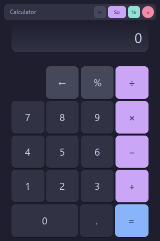

# Calculator



A compact desktop calculator used for exercising Glyx's native (Rust + JS) toolchain. Frameless window with a custom draggable title bar, a Catppuccin color theme, standard and scientific keypads, a live expression bar, and a scrollable history panel.

## Run it

```bash
cd examples/calculator
glyx dev
```

See the [full write-up](https://glyx.dev/examples/calculator) on the docs site.
