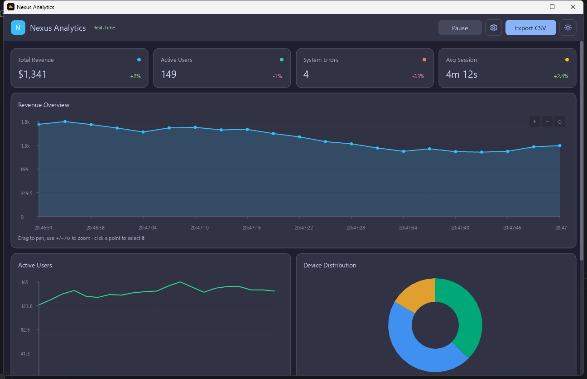

# Dashboard — Real-Time Analytics



A live analytics dashboard ("Nexus Analytics"). Streaming data updates four widgets every two seconds, KPI stat cards recompute on each tick, and widgets can be toggled on or off from the settings menu. A faithful port of the `glyx-design-kit` dashboard template to Glyx.

**Mode:** JS-only dev (runs on the prebuilt `glyx-runner` — no Rust compile).

## Run it

```bash
cd examples/dashboard
glyx dev
```

See the [full write-up](https://glyx.dev/examples/dashboard) on the docs site.
