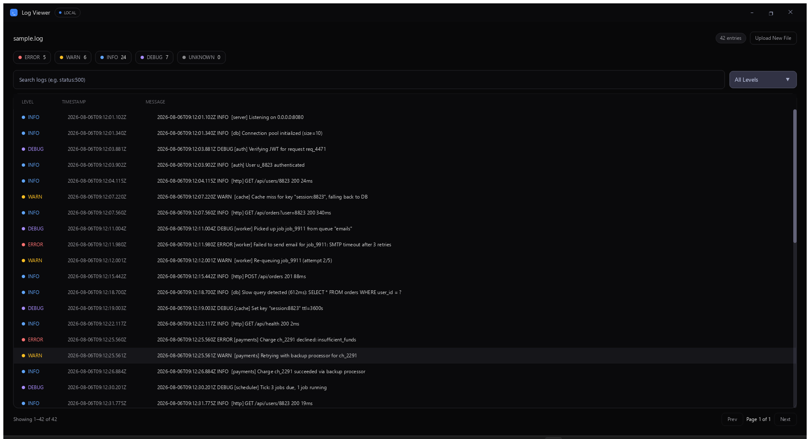

# Log Viewer



A real-time log file viewer. Opens any log file, tails it for new lines, and renders large files without performance issues.

## Run it

```bash
cd examples/log-viewer
glyx dev
```

A `sample.log` file is included in this folder if you want something to open immediately.

See the [full write-up](https://glyx.dev/examples/log-viewer) on the docs site.
