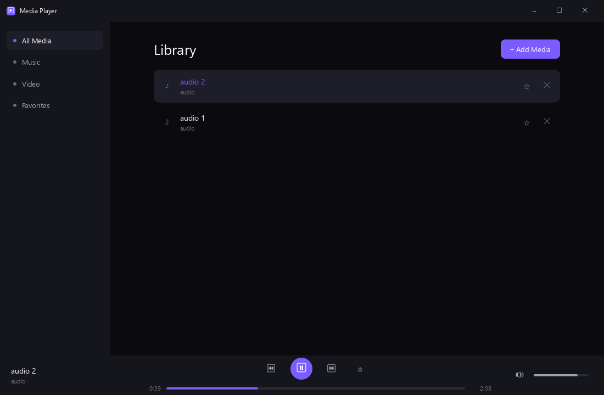

# Media Player



A local audio/video library and player. Demonstrates the `audio` capability, file import via the native file picker, favorites, and track removal.

## Run it

```bash
cd examples/media-player
glyx dev
```

See the [full write-up](https://glyx.dev/examples/media-player) on the docs site.
