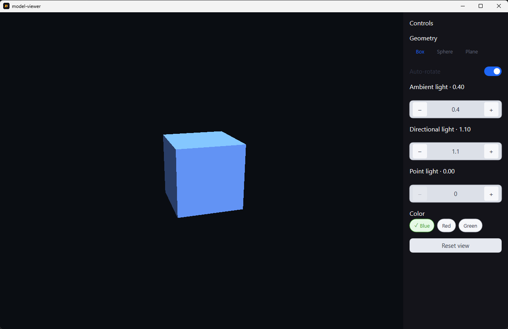

# 3D Viewer



An interactive 3D scene built with `@glyx-dev/three` on the GPU `Canvas3D`. Box / sphere / plane primitives, lighting controls, color, and auto-rotate.

## Run it

```bash
cd examples/model-viewer
glyx dev
```

See the [full write-up](https://glyx.dev/examples/model-viewer) on the docs site.
