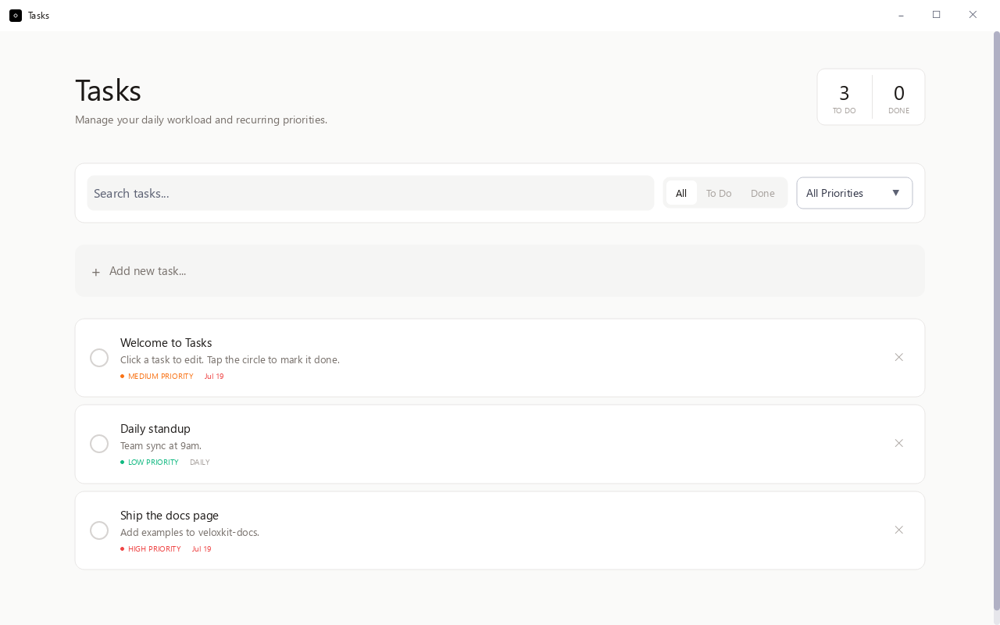

# Tasks — SQLite Task Manager



A persistent to-do manager. Demonstrates the `db` capability (SQLite) end-to-end, router-based screens, the `@glyx-dev/design` component library, and light/dark theming — all in ~250 lines of React.

## Run it

```bash
cd examples/tasks
glyx dev
```

See the [full write-up](https://glyx.dev/examples/tasks) on the docs site.
